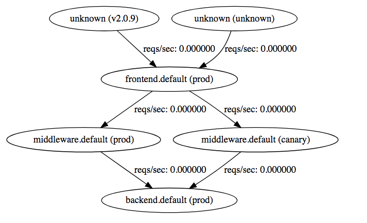
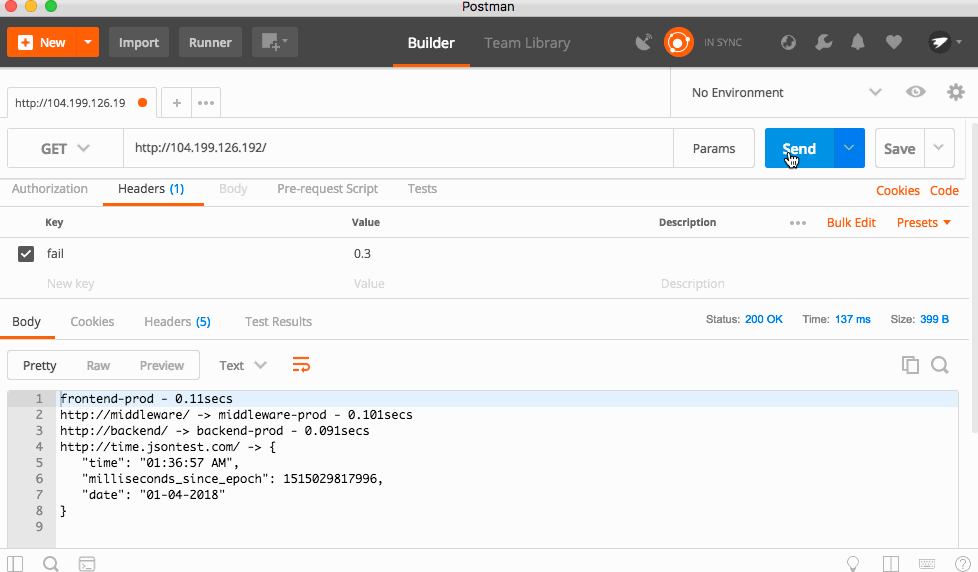
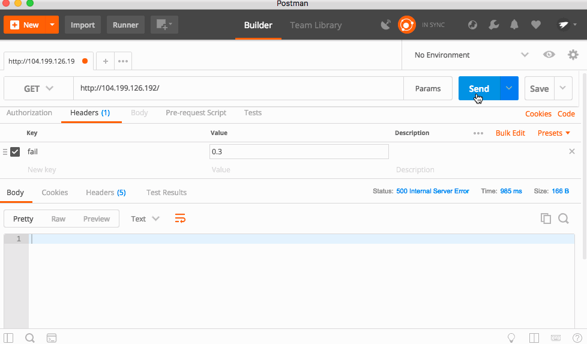
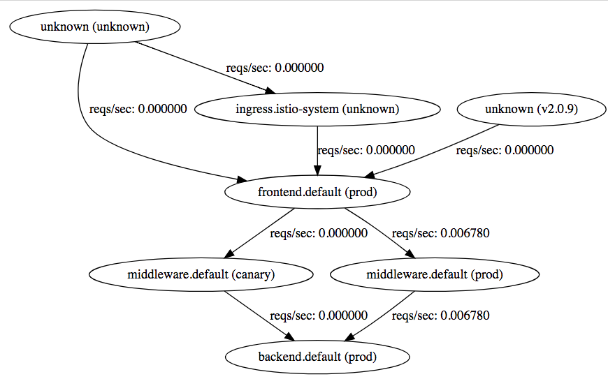
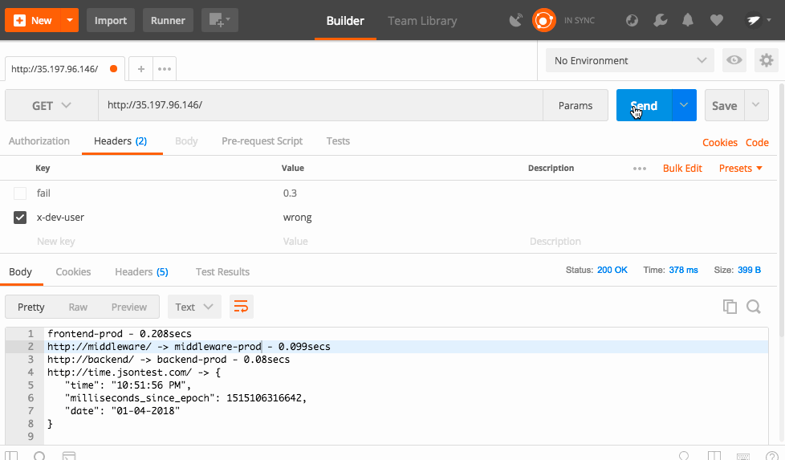
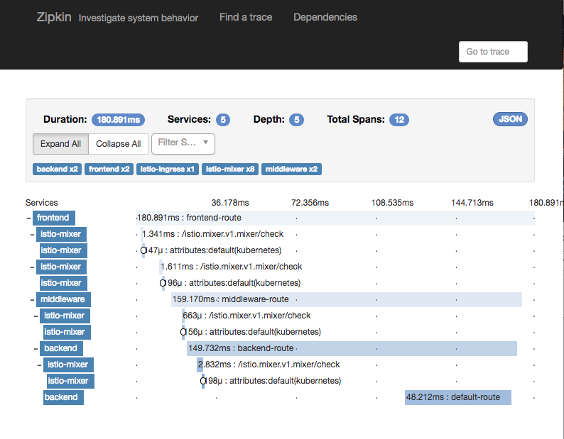
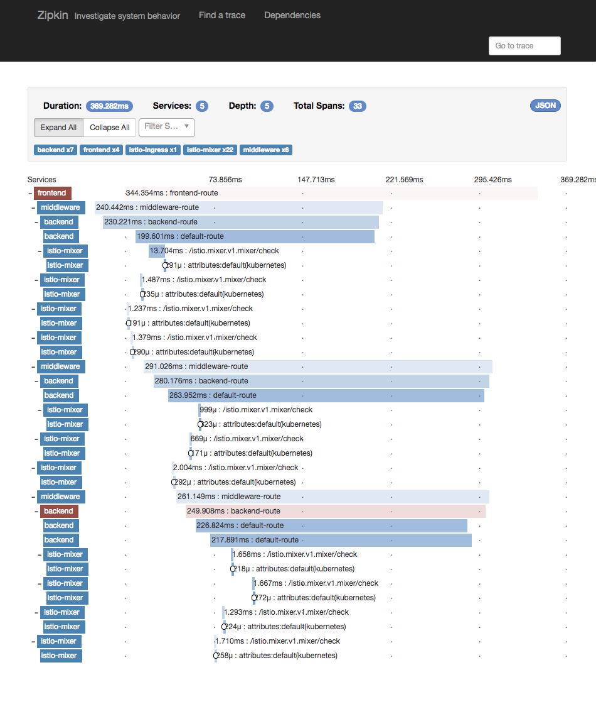
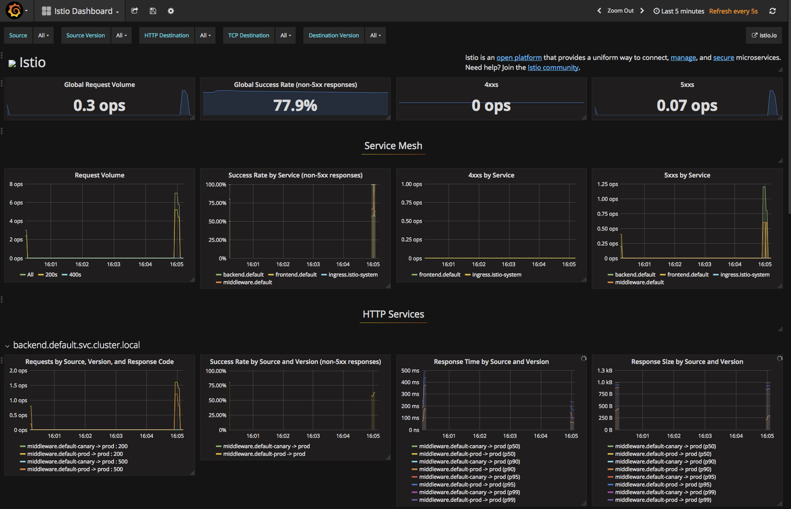

# Istio 101 - Lightning Demo

This is the code I use for my Istio 101 talk. Please take a look! I assume some prior knowledge of Kubernetes, but it's not totally required.

Talk Video:
[](https://www.youtube.com/watch?v=8OjOGJKM98o)

# TL;DR - I want to skip setup

Run this:

`make create-cluster deploy-istio build push deploy-stuff`

Run this in another terminal:

`make start-monitoring-services`

# Setup

## Cluster Setup
You need a Kubernetes 1.7.3 or newer cluster with Alpha features and RBAC (Role-Based Access
Control) enabled.

You will also need Docker and kubectl 1.7.3 or newer installed on your machine, as well as the Google Cloud SDK. You can install the Google Cloud SDK (which will also install kubectl) [here](https://cloud.google.com/sdk).

To create the cluster with Google Kubernetes Engine, run this command:

`make create-cluster`

This will create an Alpha cluster called "my-istio-cluster" with 4 nodes in the us-west1-b region. This will deploy into the current active project set in your Google Cloud SDK. You can change this by passing in a custom value for the Project ID and/or Zone.

`make create-cluster PROJECT_ID=your-custom-id-here ZONE=your-custom-zone`

## Istio Setup
You need to install the [istioctl tool locally](https://github.com/istio/istio/releases). This release has been tested with Istio 0.2.10. Compatibility with later versions of Istio is not guaranteed, but please send Pull Requests if you test with a later version of Istio. I will be updating this demo when Istio releases a stable version.

To deploy Istio into the cluster, run

`make deploy-istio`

This will deploy a pinned version of the Istio system into your Kubernetes Cluster. Istio will create its own Kubernetes Namespace and a bunch of services and deployments. In addition, this command will install helper services. Zipkin for tracing, Prometheus for monitoring, Servicegraph to visualize your microservices, and Grafana for viewing metrics.

## Start Helper Services

Run this in another terminal:

`make start-monitoring-services`

This will create tunnels into your Kubernetes cluster for [Zipkin](http://localhost:9411), [Servicegraph](http://localhost:8088), and [Grafana](http://localhost:3000). This command will not exit as it keeps the connection open.

## Create Docker Container

To build and push the code, run:

`make build push`

This will create the Docker contaienr and push it up to your Google Container Registry. 

Again, you can pass in a custom project ID, but make sure it is the same as before:

`make build push PROJECT_ID=your-custom-id-here`

## Deploy Kubernetes Services

This will create the three Deployments and the three Services. The initial frontend service will be a externally load balanced service, so it will get a public IP.

`make deploy-stuff`

Again, you can pass in a custom project ID, but make sure it is the same as before:

`make deploy-stuff PROJECT_ID=your-custom-id-here`

# The Code

The above command deployed three microservices all running the same code, with a different configuration for each. The [code](./code/index.js) is super simple, all it does it make a request to a downstream service, takes the result, and concatenates it with the its own name, some latency information, and the downstream URL.

This is a great demo app for Istio, because you can chain together an "infinite" number of these to create deep trees of services that simulate real microservice deployments.

# Using Istio

Let's see the Kubernetes resources:

`make get-stuff`

You should see something like this:
```
kubectl get pods && kubectl get svc && kubectl get ingress
NAME                                 READY     STATUS    RESTARTS   AGE
backend-prod-1666293437-dcrnp        2/2       Running   0          21m
frontend-prod-3237543857-g8fpp       2/2       Running   0          22m
middleware-canary-2932750245-cj8l6   2/2       Running   0          21m
middleware-prod-1206955183-4rbpt     2/2       Running   0          21m
NAME         CLUSTER-IP    EXTERNAL-IP       PORT(S)        AGE
backend      10.3.252.16   <none>            80/TCP         22m
frontend     10.3.248.79   104.XXX.XXX.XXX   80:30402/TCP   22m
kubernetes   10.3.240.1    <none>            443/TCP        23m
middleware   10.3.251.46   <none>            80/TCP         22m
```

## Where is Istio?

You might notice there is no trace of Istio to be seen. This is because the Istio control plane is launched into its own Kubernetes Namespace. You can see the Istio resources with this command:

`kubectl get pods --namespace=istio-system`

We have launched Istio is "auto inject" mode. This means that any Pods that Kubernetes creates will automatically get a Istio sidecar proxy attached to it. This proxy will enforce Istio policies without any action from the app! You can also run Istio in the normal mode, and add the proxy into the Kubernetes YAML manually. Again, there is no change to the app, but the Kubernetes Deployment is manually patched. This is useful if you want some services to bypass Istio.

## Trying it out

Visit the External IP, and you should see the website load.

```
frontend-prod - 0.287secs
http://middleware/ -> middleware-canary - 0.241secs
http://backend/ -> backend-prod - 0.174secs
http://time.jsontest.com/ -> StatusCodeError: 404 - ""
```
You can see that the frontend service requests the middleware service, which requests the backend service, which finally requests time.jsontest.com

## Fixing the 404

You might notice that time.jsontest.com is returning a 404. This is because by default, Istio blocks all Egress traffic out of the cluster. This is a great security practice, as it prevents malicious code from calling home or your code from talking to unverified 3rd party services.

Let's unblock time.jsontest.com by setting a [Egress Rule](https://istio.io/docs/reference/config/traffic-rules/egress-rules.html).

You can see the Egress rule that we are going to apply [here](./configs/istio/egress.yaml), and notice that it allows both HTTP and HTTPS access to time.jsontest.com

To apply this rule, run:

`istioctl create -f ./configs/istio/egress.yaml`

Now, you should see the services fully working!

```
frontend-prod - 0.172secs
http://middleware/ -> middleware-canary - 0.154secs
http://backend/ -> backend-prod - 0.142secs
http://time.jsontest.com/ -> {
   "time": "12:43:09 AM",
   "milliseconds_since_epoch": 1515026589163,
   "date": "01-04-2018"
}
```

## Fixing the Flip Flop

If you refresh the page enough times, you might see a small change between loads. Sometimes, the middleware service is called `middleware-canary` and sometimes is it called `middleware-prod`

This is because there is a single Kubernetes service called middleware sending traffic to two deployments (called middleware-prod and middleware-canary). This is a really powerful feature that let's you do things like Blue-Green deployments and Canary testing. Using Servicegraph, we can actually see this visually.

Open Servicegraph: http://localhost:8088/dotviz

You should see something like this:


You can see that traffic goes from frontend (prod), and then is sent to either the middleware (prod) or middleware (canary), and then finally goes backend (prod)

With Istio, you can control where traffic goes using a [Routing Rule](https://istio.io/docs/reference/config/traffic-rules/routing-rules.html). For example, you can send 80% of the all traffic that is going to the middleware service to prod and 20% to canary. In this case, let's set 100% of the traffic to prod.


You can see the Routing Rule [here](./configs/istio/routing-1.yaml). This is the key section:
```yaml
spec:
  destination:
    name: middleware
  route:
  - labels:
      version: prod
```
You can see that we set up a routing rule per Kubernetes service, and we can use native Kubernetes labels to pick which deployments get sent traffic.

`istioctl create -f ./configs/istio/routing-1.yaml`

Now all traffic will be sent to the Prod Service

## Create Some Instability

In the real world, services fail all the time. In a microservices world, this means you can have thousands of downstream failures, and your app needs to be able to handle them. Istio's Service Mesh can be configured to automatically handle many of these failures so your app doesn't have to!

_Note: Istio has a feature call [Fault Injection](https://istio.io/docs/reference/config/traffic-rules/routing-rules.html#httpfaultinjection) that can simulate errors. This means you don't need to write bad code to test if your app can handle failure._

While the code we deployed is very stable, there is a hidden function that will cause the app to randomly return a 500!

The code is triggered by a HTTP Header called "fail" which is a number between 0 and 1, with 0 being a 0% chance of failure, and 1 being 100% chance.

I'll be using [Postman](https://www.getpostman.com/) to send the headers and see the result.



With a 30% failure percentage, you can see the app failing a lot, but sometimes it works. Bumping that to 50%, the app fails almost every time! This is because each service forwards headers to the downstream services, so this is a cascading error!

## Fix it with Istio

 Because the request will sometimes work and sometimes not work, this is called a flaky error. These are hard to debug because they are hard to find! If there is a very low percentage chance, then the error will only be triggered maybe one time in a million. However, that might be an important request that can potentially break everything. There is a simple fix for this type of flaky error, just retry the request! This only works up to a certain point, but can easily pave over flaky errors that have low probabilities of occurring.

 Normally, you would need to write this retry logic in every single one of your microservices for every single network request. Thankfully, Istio provides this out of the box so you don't need to modify your code at all!

 Let's modify the Routing Rule to add in some retry logic. [Here](./configs/istio/routing-2.yaml) is the updated rule. There is an additional section for each rule that looks like this:

 ```yaml
   httpReqRetries:
    simpleRetry:
      attempts: 3
      perTryTimeout: 2s
```

This means that Istio will retry the request three times before giving up, and will wait 2 seconds per retry (in case the downstream service hangs). Your app just sees it as one request, all the retry complexity is abstracted away.

Apply the rule:

`istioctl create -f ./configs/istio/routing-2.yaml `

And refresh the page:



Wait what! After applying this rule, there are still crashes! The backend and middleware don't crash any more, but the frontend still does. However, the rule is there for all three services, so what gives?

## Using Ingress

If we take a look at the Servicegraph image, you will notice that requests to the frontend service come from "unknown". 


Because we exposed the Kubernetes service directly with a LoadBalancer, requests are coming from outside the Istio mesh, so the router can't apply rules to it!

To fix this, you can use Istio's Ingress capability to act as a entrypoint into your cluster.

To do this, we will modify the frontend Kubernetes Service to no longer use a LoadBalancer.

Then, we create a Kubernetes Ingress object that will use a special annotation to use Istio:

```yaml
apiVersion: extensions/v1beta1
kind: Ingress
metadata:
  name: istio-ingress
  annotations:
    kubernetes.io/ingress.class: istio
spec:
  rules:
  - http:
      paths:
      - path: /.*
        backend:
          serviceName: frontend
          servicePort: 80
```

You can see the "ingress.class" is istio, and we have a rule that sends all http traffic to the frontend service. That's all you need to enable the Istio Ingress!

First delete the old frontend service:

`kubectl delete svc frontend`

Then apply [this file](./configs/kube/services-2.yaml)

`kubectl apply -f ./configs/kube/services-2.yaml`

Because the frontend's load balancer was deleted and a new Ingress load balancer was created, the IP address would have changed.

Find the new IP address:

`make get-stuff`
```
kubectl get pods && kubectl get svc && kubectl get ingress
NAME                                 READY     STATUS    RESTARTS   AGE
backend-prod-1666293437-dcrnp        2/2       Running   0          22h
frontend-prod-3237543857-g8fpp       2/2       Running   0          22h
middleware-canary-2932750245-cj8l6   2/2       Running   0          22h
middleware-prod-1206955183-4rbpt     2/2       Running   0          22h
NAME         CLUSTER-IP    EXTERNAL-IP   PORT(S)   AGE
backend      10.3.252.16   <none>        80/TCP    22h
frontend     10.3.253.93   <none>        80/TCP    1m
kubernetes   10.3.240.1    <none>        443/TCP   22h
middleware   10.3.251.46   <none>        80/TCP    22h
NAME            HOSTS     ADDRESS         PORTS     AGE
istio-ingress   *         35.XXX.XXX.XXX  80        3m
```

The new IP address is the istio-ingress.

Once you visit the site, you can see the updated Servicegraph:



Requests now come through the ingress.istio-system! The unknowns pointing to frontend are from historical data.

And now, all the errors are gone!


## What about that middleware canary?

If you remember, there are two middleware services. Prod and Canary. Right now, the routing rules send all traffic to Prod. This is good, because we don't want normal people accessing the Canary build.

However, we do want our dev team and trusted testers to access it. Thankfully, Istio makes doing this quite easy!

Routing Rules can have conditional routing based on things like headers, cookies, etc. We could check if a user is part of the trusted group and set a cookie that let's them access the canary service. For simplicity's sake, I'm going to use a header called "x-dev-user" and check if the value is "super-secret".

You can see the new rule in [this file](./configs/istio/routing-3.yaml)

The key part:
```yaml
  precedence: 1
  match:
    request:
      headers:
        x-dev-user:
          exact: super-secret
```

The precedence is normally 0, but here we are setting it to 1. The higher the number, the higher the priority. This means that this rule will take priority over the normal rule that sends all traffic to Prod. Then, we use the match to only apply this rule if the header "x-dev-user" exactly matches "super-secret". You can see all the match rules [here](https://istio.io/docs/reference/config/traffic-rules/routing-rules.html#matchcondition).

Apply this file:

`istioctl create -f ./configs/istio/routing-3.yaml`

And now, when you send the proper header, Istio automatically routes you to the right service.



When working with Istio, it is important that all your services forward the headers needed by the downstream services. I recommend standardizing on some headers, and ensuring that you always forward them when talking to a downstream service. There are many libraries that can do this automatically.

# Monitoring and Tracing

A awesome benefit of Istio is that it automatically adds tracing and monitoring support to your apps. While monitoring is added for free, tracing needs you to forward the trace headers that Istio's Ingress controller automatically injects so Istio can stitch together the requests. You need to forward the following headers in your code:

```
[
    'x-request-id',
    'x-b3-traceid',
    'x-b3-spanid',
    'x-b3-parentspanid',
    'x-b3-sampled',
    'x-b3-flags',
    'x-ot-span-context',
]
```

## Viewing Traces

Now, you can open [Zipkin](http://localhost:9411/), and click "Find Traces". Istio will sample your requests, so not every request will be logged.

Click a Trace, and you can see a waterfall of the requests



If we set the "fail" header, we can also see Istio's auto-retry mechanism in action:



## Viewing Metrics

To view Metrics, open [Grafana](http://localhost:3000/dashboard/db/istio-dashboard)

You can see a lot of cool metrics in the default Istio dashboard, or customize it as you see fit!



# Shutting Down The Test Cluster

`make delete-cluster`

or

`make delete-cluster PROJECT_ID=your-custom-id-here ZONE=your-custom-zone`


NOTE: This is not an official Google product
