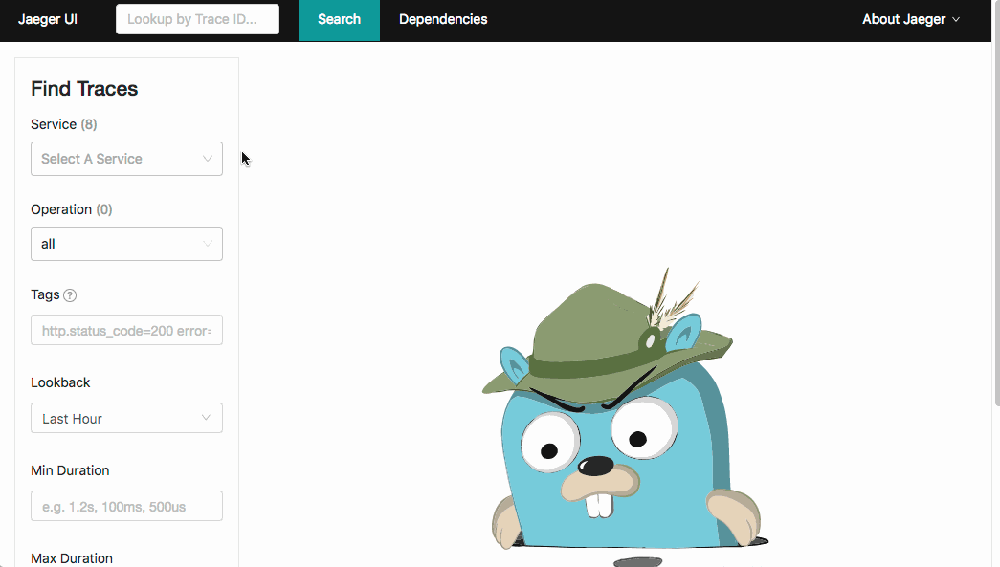

# Istio and OpenCensus 101 - Lightning Demo

This is the code I use for my Istio 101 talk and Istio and OpenCensus talk. Please take a look! I assume some prior knowledge of Kubernetes, but it's not totally required.

Talk Video:
[](https://www.youtube.com/watch?v=8OjOGJKM98o)

# TL;DR - I want to skip setup

Run this:

`make create-cluster deploy-istio build push deploy-stuff`

Run this in another terminal:

`make start-monitoring-services`

# Setup

## Cluster Setup
You need a Kubernetes 1.10 or newer cluster.

You will also need Docker and kubectl 1.9.x or newer installed on your machine, as well as the Google Cloud SDK. You can install the Google Cloud SDK (which will also install kubectl) [here](https://cloud.google.com/sdk).

To create the cluster with Google Kubernetes Engine, run this command:

`make create-cluster`

This will create a cluster called "my-istio-cluster" with 4 nodes in the us-west1-b region. This will deploy into the current active project set in your Google Cloud SDK. You can change this by passing in a custom value for the Project ID and/or Zone.

`make create-cluster PROJECT_ID=your-custom-id-here ZONE=your-custom-zone`

## Istio Setup
This project assumes you are running on x64 Linux. If you are running on another platform, I highly reccomend using [Google Cloud Shell](https://cloud.google.com/shell) to get a free x64 Linux environment.

To deploy Istio into the cluster, run

`make deploy-istio`

This will deploy the Istio services and control plane into your Kubernetes Cluster. Istio will create its own Kubernetes Namespace and a bunch of services and deployments. In addition, this command will install helper services. Jaeger for tracing, Prometheus for monitoring, Servicegraph to visualize your microservices, and Grafana for viewing metrics.

## Start Helper Services

Run this in another terminal:

`make start-monitoring-services`

This will create tunnels into your Kubernetes cluster for [Jaeger](http://localhost:16686), [Servicegraph](http://localhost:8088), and [Grafana](http://localhost:3000). This command will not exit as it keeps the connection open.

## Create Docker Container

To build and push the code, run:

`make build push`

This will create the Docker containers and push it up to your Google Container Registry. 

Again, you can pass in a custom project ID, but make sure it is the same as before:

`make build push PROJECT_ID=your-custom-id-here`

*Note:* This will build three containers, one for the vanilla Istio demo, and two for the OpenCensus demo.

## Deploy Kubernetes Services

This will create the three Deployments and the three Services.

`make deploy-stuff`

Again, you can pass in a custom project ID, but make sure it is the same as before:

`make deploy-stuff PROJECT_ID=your-custom-id-here`

# The Code

The above command deployed three microservices all running the same code, with a different configuration for each. The [code](./code/code-only-istio/index.js) is super simple, all it does it make a request to a downstream service, takes the result, and concatenates it with the its own name, some latency information, and the downstream URL.

This is a great demo app for Istio, because you can chain together an "infinite" number of these to create deep trees of services that simulate real microservice deployments.

# Using Istio

Let's see the Kubernetes resources:

`make get-stuff`

You should see something like this:
```
kubectl get pods && kubectl get svc && kubectl get ingress
NAME                                 READY     STATUS    RESTARTS   AGE
backend-prod-1666293437-dcrnp        2/2       Running   0          21m
frontend-prod-3237543857-g8fpp       2/2       Running   0          22m
middleware-canary-2932750245-cj8l6   2/2       Running   0          21m
middleware-prod-1206955183-4rbpt     2/2       Running   0          21m
NAME         CLUSTER-IP    EXTERNAL-IP       PORT(S)        AGE
backend      10.3.252.16   <none>            80/TCP         22m
frontend     10.3.248.79   <none>            80/TCP         22m
kubernetes   10.3.240.1    <none>            443/TCP        23m
middleware   10.3.251.46   <none>            80/TCP         22m
NAME                   TYPE           CLUSTER-IP     EXTERNAL-IP     PORT(S)                                                                                                     AGE
istio-ingressgateway   LoadBalancer   10.3.246.226   35.XXX.XXX.XXX  80:31380/TCP,443:31390/TCP,31400:31400/TCP,15011:31754/TCP,8060:32056/TCP,15030:31770/TCP,15031:32112/TCP   2m
```

## Where is Istio?

Aside from the "istio-ingressgateway", you might notice there is no trace of Istio to be seen. This is because the Istio control plane is launched into its own Kubernetes Namespace. You can see the Istio resources with this command:

`kubectl get pods --namespace=istio-system`

We have launched Istio in "auto inject" mode. After the Makefile deployed Istio, the Makefile ran this command:

`kubectl label namespace default istio-injection=enabled`

This means that any Pods that Kubernetes creates in the default namespace will automatically get a Istio sidecar proxy attached to it. This proxy will enforce Istio policies without any action from the app! You can also run Istio in the normal mode, and add the proxy into the Kubernetes YAML manually. Again, there is no change to the app, but the Kubernetes Deployment is manually patched. This is useful if you want some services to bypass Istio.

## Trying it out

You may notice that none of our services have External IPs. This is because we want Istio to manage all inboud traffic. To do this, Istio uses an [Ingress Gateways](https://istio.io/docs/tasks/traffic-management/ingress/#configuring-ingress-using-an-istio-gateway).

Visit the External IP of the "istio-ingressgateway". At this point, you should get an error!

**Don't worry! Everything is ok!**

Right now, the gateway is not set-up, so it is dropping all traffic at the edge. Let's set it up with this command:

`kubectl create -f ./configs/istio/ingress.yaml`

This file contains two objects. The first object is a Gateway, which will allow us to bind to the "istio-ingressgateway" that exists in the cluster. The second object is a VirtualService, which let's us apply routing rules. Because we are using a wildcard (*) charater for the host and only one route rule, all traffic from this gateway to the frontend service.

Visit the IP address again, and you should see that it is working!

```
frontend-prod - 0.287secs
http://middleware/ -> middleware-canary - 0.241secs
http://backend/ -> backend-prod - 0.174secs
http://time.jsontest.com/ -> StatusCodeError: 404 - ""
```
You can see that the frontend service requests the middleware service, which requests the backend service, which finally requests time.jsontest.com

## Fixing the 404

You might notice that time.jsontest.com is returning a 404. This is because by default, Istio blocks all Egress traffic out of the cluster. This is a great security practice, as it prevents malicious code from calling home or your code from talking to unverified 3rd party services.

Let's unblock time.jsontest.com by creating a [ServiceEntry](https://istio.io/docs/tasks/traffic-management/egress/).

You can see the ServiceEntry that we are creating [here](./configs/istio/egress.yaml), and notice that it allows both HTTP and HTTPS access to time.jsontest.com

To apply this rule, run:

`kubectl apply -f ./configs/istio/egress.yaml`

Now, you should see the services fully working!

```
frontend-prod - 0.172secs
http://middleware/ -> middleware-canary - 0.154secs
http://backend/ -> backend-prod - 0.142secs
http://time.jsontest.com/ -> {
   "time": "12:43:09 AM",
   "milliseconds_since_epoch": 1515026589163,
   "date": "01-04-2018"
}
```

## Fixing the Flip Flop

If you refresh the page enough times, you might see a small change between loads. Sometimes, the middleware service is called `middleware-canary` and sometimes is it called `middleware-prod`

This is because there is a single Kubernetes service called middleware sending traffic to two deployments (called middleware-prod and middleware-canary). This is a really powerful feature that let's you do things like Blue-Green deployments and Canary testing. Using Servicegraph, we can actually see this visually.

Open Servicegraph: http://localhost:8088/dotviz

You should see something like this:


You can see that traffic goes from frontend (prod), and then is sent to either the middleware (prod) or middleware (canary), and then finally goes backend (prod)

With Istio, you can control where traffic goes using a [VirtualService](https://istio.io/docs/reference/config/istio.networking.v1alpha3/#VirtualService). For example, you can send 80% of the all traffic that is going to the middleware service to prod and 20% to canary. In this case, let's set 100% of the traffic to prod.

You can see the VirtualServices [here](./configs/istio/routing-1.yaml).

There are a few interesting things about this file.

You might notice that the frontend VirtualService looks different than the others. This is because we are binding the frontend service to the gateway.

Next comes the way we are making all traffic go to the "prod" deployment. This is the key section for the middleware VirtualService is:
```yaml
  http:
  - route:
    - destination:
        host: middleware
        subset: prod
```

You might be wondering, where is this "subset" defined? How does Istio know what "prod" is?

You can define these subsets in something called a [DestinationRule](https://istio.io/docs/reference/config/istio.networking.v1alpha3/#DestinationRule).

Our DestinationRules are defined [here](./configs/istio/destinationrules.yaml). Let's look at the important part of the middleware rule:

```yaml
spec:
  host: middleware
  trafficPolicy:
    tls:
      mode: ISTIO_MUTUAL
  subsets:
  - name: prod
    labels:
      version: prod
  - name: canary
    labels:
      version: canary
```

First, we are setting a trafficPolicy that ensures that all traffic is encrypted with Mutual TLS. This means that we get encryption and we can actually restrict which services get access to other services inside the mesh. Even if someone breaks into your cluster, they can't impersonate another service if you are using mTLS, thus limiting the damange they can do.

Next, you can see how the subsets are defined. We give each subset a name, and then use Kubernetes lables to select the pods in each subset. We are creating a prod and canary subet in this case.

Let's create the DestinationRules and the VirtualServices:

`kubectl apply -f ./configs/istio/destinationrules.yaml`

`kubectl apply -f ./configs/istio/routing-1.yaml`

Now all traffic will be sent to the middleware-prod service.

## Create Some Instability

In the real world, services fail all the time. In a microservices world, this means you can have thousands of downstream failures, and your app needs to be able to handle them. Istio's Service Mesh can be configured to automatically handle many of these failures so your app doesn't have to!

_Note: Istio has a feature call [Fault Injection](https://istio.io/docs/tasks/traffic-management/fault-injection/) that can simulate errors. This means you don't need to write bad code to test if your app can handle failure._

While the code we deployed is very stable, there is a hidden function that will cause the app to randomly return a 500!

The code is triggered by a HTTP Header called "fail" which is a number between 0 and 1, with 0 being a 0% chance of failure, and 1 being 100% chance.

I'll be using [Postman](https://www.getpostman.com/) to send the headers and see the result.


With a 30% failure percentage, you can see the app failing a lot, but sometimes it works. Bumping that to 50%, the app fails almost every time! This is because each service forwards headers to the downstream services, so this is a cascading error!

## Fix it with Istio

 Because the request will sometimes work and sometimes not work, this is called a flaky error. These are hard to debug because they are hard to find! If there is a very low percentage chance, then the error will only be triggered maybe one time in a million. However, that might be an important request that can potentially break everything. There is a simple fix for this type of flaky error, just retry the request! This only works up to a certain point, but can easily pave over flaky errors that have low probabilities of occurring.

 Normally, you would need to write this retry logic in every single one of your microservices for every single network request. Thankfully, Istio provides this out of the box so you don't need to modify your code at all!

 Let's modify the VirtualServices to add in some retry logic. [Here](./configs/istio/routing-2.yaml) is the updated rule. There is an additional section for each that looks like this:

 ```yaml
    retries:
      attempts: 3
      perTryTimeout: 2s
```

This means that Istio will retry the request three times before giving up, and will wait 2 seconds per retry (in case the downstream service hangs). Your app just sees it as one request, all the retry complexity is abstracted away.

Apply the rule:

`kubectl apply -f ./configs/istio/routing-2.yaml`

And refresh the page:


And now, all the errors are gone!

## What about that middleware canary?

If you remember, there are two middleware services. Prod and Canary. Right now, the rules send all traffic to Prod. This is good, because we don't want normal people accessing the Canary build.

However, we do want our dev team and trusted testers to access it. Thankfully, Istio makes doing this quite easy!

Routing Rules can have conditional routing based on things like headers, cookies, etc. We could check if a user is part of the trusted group and set a cookie that let's them access the canary service. For simplicity's sake, I'm going to use a header called "x-dev-user" and check if the value is "super-secret".

You can see the new rule in [this file](./configs/istio/routing-3.yaml)

```yaml
  http:
  - match:
    - headers:
        x-dev-user:
          exact: super-secret
    route:
      - destination:
          host: middleware
          subset: canary
    retries:
      attempts: 3
      perTryTimeout: 2s
  - route:
    - destination:
        host: middleware
        subset: prod
    retries:
      attempts: 3
      perTryTimeout: 2s
```

You can see that we are checking if the "x-dev-user" header is set to "super-secret" and if it is then we send traffic to the canary subset. Otherwise, traffic gets sent to prod.

Apply this file:

`kubectl apply -f ./configs/istio/routing-3.yaml`

And now, when you send the proper header, Istio automatically routes you to the right service.


When working with Istio, it is important that all your services forward the headers needed by the downstream services. I recommend standardizing on some headers, and ensuring that you always forward them when talking to a downstream service. There are many libraries that can do this automatically.

# Monitoring and Tracing

A awesome benefit of Istio is that it automatically adds tracing and monitoring support to your apps. While monitoring is added for free, tracing needs you to forward the trace headers that Istio's Ingress controller automatically injects so Istio can stitch together the requests. You need to forward the following headers in your code:

```
[
    'x-request-id',
    'x-b3-traceid',
    'x-b3-spanid',
    'x-b3-parentspanid',
    'x-b3-sampled',
    'x-b3-flags',
    'x-ot-span-context',
]
```

The sample microservice you deployed already does this.

## Viewing Traces

Now, you can open [Jaeger](http://localhost:16686/), select the "frontend" service, and click "Find Traces". Istio will sample your requests, so not every request will be logged.

Click a Trace, and you can see a waterfall of the requests. Because we set the "fail" header, we can also see Istio's auto-retry mechanism in action!



## Viewing Metrics

To view Metrics, open [Grafana](http://localhost:3000/dashboard/db/istio-dashboard)

You can see a lot of cool metrics in the default Istio dashboard, or customize it as you see fit!


# OpenCensus

While Istio is great for network level tracing and metrics, it is important to also collect information about what is going on *inside* you app. This is where OpenCensus comes into play. OpenCensus is a vendor-neutral tracing and metrics library thats built for mulitple popular langauges.

Let's add OpenCensus to our app and see how it can help!

## Automatic Header Forwarding

If you remember from the tracing section of this README, we had to manually foward all those `x-blah-blah` headers for each incoming and outgoing reqest.

One really cool thing about OpenCensus is that it can automatically forward these headers for the majorty of popular server frameworks.

You can see the full code [here](./code/code-opencensus-simple/index.js), but the  key part is at the top:

```javascript
const tracing = require('@opencensus/nodejs');
const propagation = require('@opencensus/propagation-b3');
const b3 = new propagation.B3Format();

tracing.start({
	propagation: b3,
	samplingRate: 1.0
});
```

Just put this little snippit at the top of your code and every single request will get trace headers automatically added! You can change the `samplingRate` if you don't want every request to be traced (which can get overwhleming for large systems).

While our test app only has one route and one downstream call, you can see how this would be very useful for a real server which has many routes and downstream calls. Without this, you would have to add header forwarding to every single route and downstream call yourself!

Let's deploy this code:

`make deploy-opencensus-code`

You shouldn't notice anything different (expct for the text indicating its using "opencensus simple"), but the big difference is our code no longer has to manually forward these headers.

## In-app Tracing

While tracing network reqests is great, OpenCensus can also trace function calls inside your app and tie them together with the network traces! This give you more visibility into what exactly is going on inside your microservices.

You can see the full code [here](./code/code-opencensus-full/index.js).

In the setup, we need to tell OpenCensus how to connect to the Jaeger instance that is running in the Istio namepsace.

```javascript
// Set up jaeger
const jaeger = require('@opencensus/exporter-jaeger')

const jaeger_host = process.env.JAEGER_HOST || 'localhost'
const jaeger_port = process.env.JAEGER_PORT || '6832'

const exporter = new jaeger.JaegerTraceExporter({
	host: jaeger_host,
    port: jaeger_port,
	serviceName: service_name,
});

tracing.start({
	propagation: b3,
	samplingRate: 1.0,
    exporter: exporter
});
```

The environment variables that the code uses are set in a Kubernetes [ConfigMap](./configs/opencensus/config.yaml).
In the `tracing.start` function, we simply pass in the exporter that we created with the Jaeger details, and that's it! We are all set up!

Now you can create custom spans to trace anything you want. Because OpenCensus automatically creates "rootSpans" for all incoming web requests, you can start creating "childSpans" inside the routes very easily:

```javascript
  const childSpan = tracing.tracer.startChildSpan('Child Span!')
  // Do Stuff
  childSpan.end()
```

If you want to create grandchildren, just make sure to set the parentSpanId to the child's id.

```javascript
  const childSpan = tracing.tracer.startChildSpan('Child Span!')
    // Do Child Stuff
    const grandchildSpan = tracing.tracer.startChildSpan('Grandchild Span!')
    grandchildSpan.parentSpanId = childSpan.id
    // Do Granchild Stuff
    grandchildSpan.end()
  childSpan.end()
```

In our code, we calculate a random Fibonacci number and then sleep for a bit. It's a silly example, but it demonstrates tracing well!


You can see all the nested traces, and the really cool thing is that you can see the traces for all three microservices at the same time! This is because OpenCensus and Istio are using the same IDs throughout the stack.

# Custom Metrics

While Istio can give you a lot of network level metrics, once again it is not able to give you app specific metrics that you might care about. Just like app-level tracing, OpenCensus can help you with app-level metrics as well.

**COMING SOOON!**

# Shutting Down The Test Cluster

`make delete-cluster`

or

`make delete-cluster PROJECT_ID=your-custom-id-here ZONE=your-custom-zone`


# Advanced

## Customize the Istio Deployment

If you want to customize the components of Istio that are installed, you can do that with Helm! First, you need to download the 1.0 release of Istio which contains the Helm charts you need.

`make download-istio`

Then, you can generate the Istio yaml that I use for this demo with the following command:

`helm template istio-1.0.0/install/kubernetes/helm/istio --name istio --namespace istio-system --set global.mtls.enabled=true --set tracing.enabled=true --set servicegraph.enabled=true --set grafana.enabled=true > istio.yaml`

Feel free to [modify this command](https://istio.io/docs/reference/config/installation-options/) to suite your needs, but note that this demo won't work without these things enabled!

NOTE: This is not an official Google product
